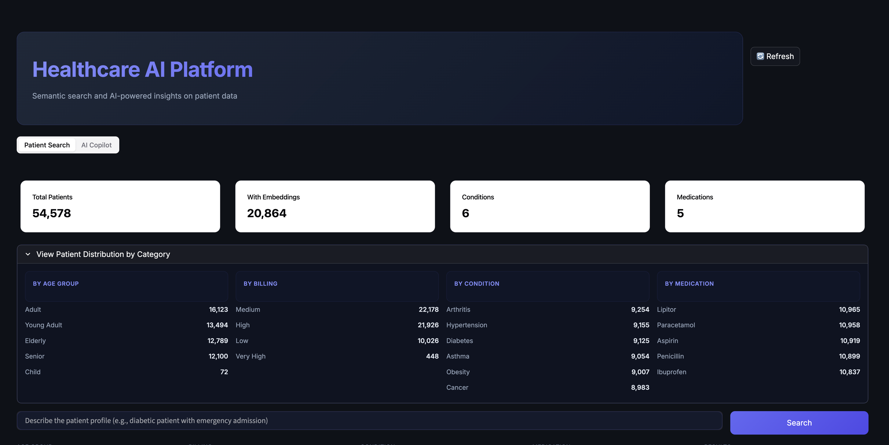
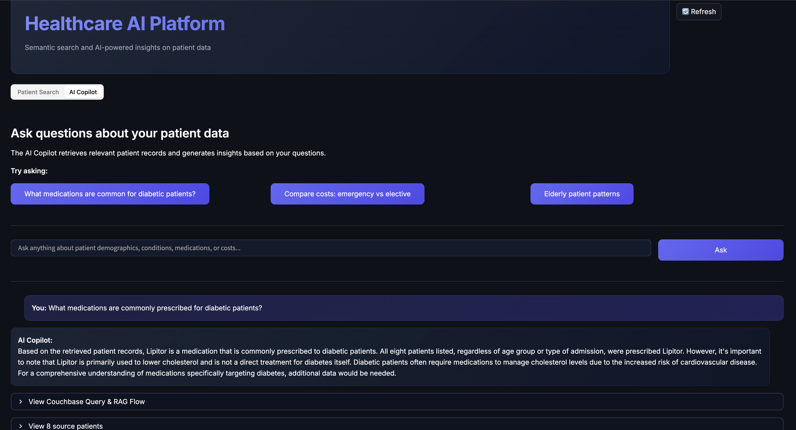
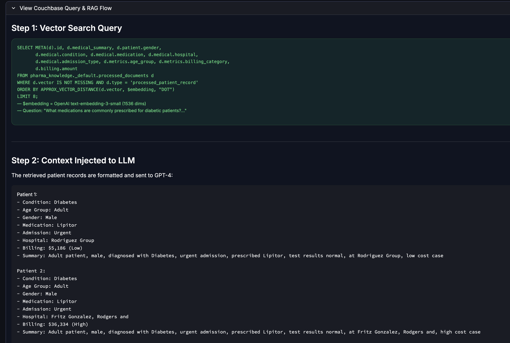
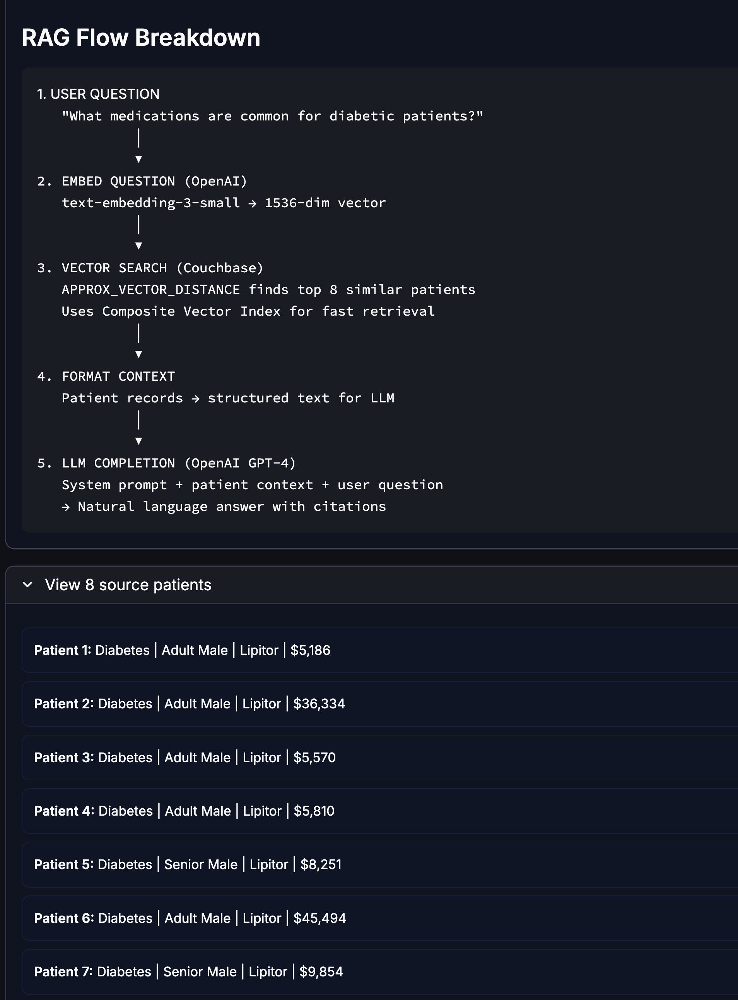

# Couchbase AI-Ready Data Pipeline

A demonstration of the **Knowledge Preparation Layer** - the critical step BEFORE retrieval in any RAG (Retrieval-Augmented Generation) pipeline.

This project shows how Couchbase Capella's Eventing Service can automatically transform raw, messy, PII-laden data into clean, enriched, retrieval-ready documents at scale - in real-time, with zero ETL pipelines. It then generates vector embeddings and powers a semantic search UI with an AI Copilot.



## What It Does

1. **PII Redaction** - Automatically redacts patient names and sensitive identifiers (HIPAA-compliant)
2. **Metadata Enrichment** - Classifies age groups, billing categories, and standardizes test results
3. **Data Structuring** - Organizes flat records into nested, queryable document structures
4. **Audit Trail** - Captures what was redacted, when, and compliance flags for governance
5. **Vector Embedding Generation** - Generates vector embeddings (OpenAI or HuggingFace) on processed documents for semantic search
6. **Intelligent Search UI** - Streamlit app with semantic patient search and AI Copilot (RAG) powered by Couchbase Vector Search + OpenAI

### AI Copilot -- Ask Questions About Your Patient Data

Ask natural language questions and get AI-generated insights grounded in your actual patient records:



### Full RAG Transparency -- See Exactly How It Works

Every AI response shows the Couchbase vector search query, the context injected into GPT-4, and the source patients cited:





---

## Bucket Structure

The project uses a single Couchbase bucket `pharma_knowledge` organized into scopes and collections:

```
pharma_knowledge (bucket)
├── _default (scope)                    — Main application data
│   ├── raw_documents                   — Raw patient records land here (with PII)
│   ├── processed_documents             — Clean, enriched, retrieval-ready documents
│   ├── stats                           — Pipeline statistics and counters
│   └── _default                        — System default (unused)
│
├── storage (scope)                     — Eventing internal storage
│   └── metadata                        — Eventing checkpoints and state tracking
│
└── _system (scope)                     — Couchbase system scope (managed automatically)
```

### How data flows through the collections

1. **`raw_documents`** -- The `load_healthcare_data.py` script inserts patient records here with `processing_status: "pending"`. These records contain raw PII (patient names), unstructured metadata, and flat fields straight from the source CSV.

2. **`processed_documents`** -- The Eventing function `knowledge_pipeline` watches `raw_documents`. When it detects a document with `processing_status: "pending"`, it automatically:
   - Redacts PII (patient names become `[NAME_REDACTED]`)
   - Enriches metadata (age groups, billing categories, test result classifications)
   - Restructures the flat record into nested objects (patient, medical, billing, metrics)
   - Writes the clean document here with `is_pii_compliant: true` and `is_searchable: true`
   
   The vector embedding eventing function then adds a `vector` field and `medical_summary` to each processed document. This collection is what downstream AI/search applications query -- every document is HIPAA-compliant and retrieval-ready.

3. **`stats`** -- Stores pipeline-level statistics (e.g., total documents processed, processing rates).

4. **`storage.metadata`** -- Used internally by the Couchbase Eventing Service to track function checkpoints, progress, and DCP stream state. You configure this when deploying the eventing function but never read/write to it from application code.

### End-to-end data flow

```
  CSV Dataset (55,500 records)
      │
      ▼
  load_healthcare_data.py
      │
      ▼
  raw_documents ─── knowledge_pipeline ──────► processed_documents
  (PII, flat)       [Redact → Enrich]           (Clean, structured)
                                                       │
                                                       ▼
                                          vector_embedding_pipeline
                                          [OpenAI text-embedding-3-small]
                                                       │
                                                       ▼
                                          processed_documents (same doc)
                                          (+ 1536-dim vector + medical_summary)
                                                       │
                                                       ▼
                                          Streamlit intelligent_search.py
                                          [Semantic Search + AI Copilot (GPT-4)]
```

---

## Prerequisites

- Python 3.9+
- A [Couchbase Capella](https://cloud.couchbase.com/) cluster with a bucket named `pharma_knowledge`
- An [OpenAI API key](https://platform.openai.com/api-keys) (for vector embeddings and AI Copilot)

## Security Notice

**DO NOT commit private keys, passwords, or API tokens to GitHub.**

This project uses a `.env` file for all credentials. The `.env` file is listed in `.gitignore` and should never be checked in.

Before pushing to GitHub:
1. Verify `.env` is **not** staged: `git status` should not show `.env`
2. Use `.env.example` as a template - copy it to `.env` and fill in your real credentials locally
3. Never hardcode credentials in source files

---

## Getting Started (End-to-End)

### Step 1: Clone and configure

```bash
git clone <repo-url>
cd couchbase-ai-ready-pipeline

# Copy the example env file and fill in your credentials
cp .env.example .env
```

Edit `.env` with your real values:
```
COUCHBASE_CONNECTION_STRING=couchbases://cb.<your-cluster-id>.cloud.couchbase.com
COUCHBASE_USERNAME=<your-username>
COUCHBASE_PASSWORD=<your-password>
COUCHBASE_BUCKET=pharma_knowledge
OPENAI_API_KEY=<your-openai-api-key>
```

### Step 2: Install dependencies

```bash
pip install -r requirements.txt
```

### Step 3: Set up Couchbase collections and indexes

```bash
python scripts/setup_couchbase.py
```

This creates the `raw_documents`, `processed_documents`, and `metadata` collections plus the necessary indexes.

### Step 4: Load data into Couchbase

The healthcare dataset (55,500 records) is already included in `data/raw/`. No need to download it separately.

```bash
python scripts/load_healthcare_data.py
```

This loads all 55,500 patient records into `raw_documents` with `processing_status: "pending"`.

### Step 5: Deploy the Knowledge Pipeline (Eventing Function #1)

This function watches `raw_documents` and automatically redacts PII, enriches metadata, and writes clean documents to `processed_documents`.

1. Open Capella -> **Data Tools** -> **Eventing**
2. Click **Add Function**
3. Configure:
   - **Name:** `knowledge_pipeline`
   - **Source Bucket:** `pharma_knowledge`
   - **Source Scope:** `_default`
   - **Source Collection:** `raw_documents`
   - **Metadata Bucket:** `pharma_knowledge`
   - **Metadata Scope:** `storage`
   - **Metadata Collection:** `metadata`
4. Add a **Bucket Binding**:
   - **Alias:** `processed_docs`
   - **Bucket:** `pharma_knowledge`
   - **Scope:** `_default`
   - **Collection:** `processed_documents`
   - **Access:** Read/Write
5. Copy/paste code from `eventing/knowledge_pipeline.js`
6. **Deploy** and **Resume**

### Step 6: Verify PII redaction and enrichment

Run these queries in the Capella Query Workbench:

```sql
-- Count processed documents (should match raw_documents count)
SELECT COUNT(*) as total
FROM `pharma_knowledge`._default.processed_documents;

-- Verify PII redaction worked
SELECT COUNT(*) as redacted
FROM `pharma_knowledge`._default.processed_documents
WHERE patient.name = "[NAME_REDACTED]";

-- Query enriched metadata by medical condition
SELECT metadata.medical_condition, COUNT(*) as count
FROM `pharma_knowledge`._default.processed_documents
GROUP BY metadata.medical_condition
ORDER BY count DESC
LIMIT 10;
```

### Step 7: Deploy the Vector Embedding Pipeline (Eventing Function #2)

This function watches `processed_documents` and generates a vector embedding for each document using OpenAI's `text-embedding-3-small` model (1536 dimensions).

1. Open Capella -> **Data Tools** -> **Eventing**
2. Click **Add Function**
3. Configure:
   - **Name:** `vector_embedding_openai_pipeline`
   - **Source Bucket:** `pharma_knowledge`
   - **Source Scope:** `_default`
   - **Source Collection:** `processed_documents`
   - **Metadata Bucket:** `pharma_knowledge`
   - **Metadata Scope:** `storage`
   - **Metadata Collection:** `metadata`
4. Add a **URL Binding**:
   - **Alias:** `openaiApi`
   - **URL:** `https://api.openai.com/v1/embeddings`
   - **Auth Type:** Bearer
   - **Bearer Key:** your OpenAI API key
5. Add a **Bucket Binding**:
   - **Alias:** `dst_bucket`
   - **Bucket:** `pharma_knowledge`
   - **Scope:** `_default`
   - **Collection:** `processed_documents`
   - **Access:** Read/Write
6. Copy/paste code from `eventing/vector_embedding_openai_pipeline.js`
7. **Deploy** and **Resume**

See **[VECTOR_EMBEDDING_SETUP.md](VECTOR_EMBEDDING_SETUP.md)** for a detailed walkthrough with troubleshooting tips.

### Step 8: Trigger embeddings for existing documents

The eventing function only fires on document changes. To generate embeddings for documents that were already processed, "touch" them:

**Option A: Python script (recommended)**
```bash
python scripts/trigger_embeddings.py
```

**Option B: SQL from Capella Query Workbench**
```sql
-- Trigger a batch of 1000 documents at a time
UPDATE pharma_knowledge._default.processed_documents
SET _trigger = NOW_MILLIS()
WHERE type = "processed_patient_record" AND vector IS MISSING
LIMIT 1000;
```

See `scripts/trigger_embeddings.sql` for more batch queries.

### Step 9: Verify embeddings

```bash
python scripts/verify_embeddings.py
```

Or from the Query Workbench:
```sql
SELECT COUNT(*) FILTER (WHERE vector IS NOT MISSING) AS with_vector,
       COUNT(*) FILTER (WHERE vector IS MISSING AND type = "processed_patient_record") AS without_vector
FROM pharma_knowledge._default.processed_documents;
```

### Step 10: Launch the Streamlit app

```bash
streamlit run app/intelligent_search.py
```

Open **http://localhost:8501** in your browser. The app has two tabs:

- **Patient Search** -- Semantic vector search with filters (age group, billing, condition, medication). Enter a natural language query like "diabetic patient with emergency admission and high medical costs" and get semantically similar patients ranked by vector similarity.

- **AI Copilot** -- Ask natural language questions about your patient data. The system retrieves relevant patient records via vector search, injects them as context into GPT-4, and generates grounded insights with source citations.

---

## Project Structure

```
couchbase-ai-ready-pipeline/
├── .env.example                   # Template for credentials (safe to commit)
├── .gitignore                     # Ensures .env is not committed
├── requirements.txt               # Python dependencies
├── README.md                      # This file
├── QUICKSTART.md                  # Quick start guide
├── DEMO_SCRIPT.md                 # Short demo script
├── COMPLETE_DEMO_WALKTHROUGH.md   # Full demo walkthrough
├── VECTOR_EMBEDDING_SETUP.md      # Vector embedding pipeline setup guide
├── screenshots/                   # App screenshots for README
├── app/
│   └── intelligent_search.py      # Streamlit UI (semantic search + AI Copilot)
├── scripts/
│   ├── setup_couchbase.py         # Create collections & indexes
│   ├── test_connection.py         # Test Couchbase connectivity
│   ├── download_kaggle_data.py    # Download healthcare dataset from Kaggle
│   ├── load_healthcare_data.py    # Load records into Couchbase
│   ├── trigger_embeddings.py      # Trigger embedding generation for existing docs
│   ├── trigger_embeddings.sql     # SQL queries for triggering embeddings
│   └── verify_embeddings.py       # Verify embeddings were generated correctly
├── eventing/
│   ├── knowledge_pipeline.js      # Stage 1: PII redaction + metadata enrichment
│   ├── knowledge_pipeline.json    # Eventing function export config
│   ├── vector_embedding_pipeline.js       # Stage 2: HuggingFace BGE embeddings (768-dim)
│   └── vector_embedding_openai_pipeline.js # Stage 2 alt: OpenAI embeddings (1536-dim)
└── data/
    └── raw/                       # Included healthcare dataset (5MB)
```

## Dataset

This demo includes the [Healthcare Dataset](https://www.kaggle.com/datasets/prasad22/healthcare-dataset) from Kaggle (~5MB, already in `data/raw/`), which contains synthetic patient records with names, ages, medical conditions, billing amounts, and more. No separate download is needed.

## Demo Guides

- **[QUICKSTART.md](QUICKSTART.md)** - Step-by-step setup instructions
- **[DEMO_SCRIPT.md](DEMO_SCRIPT.md)** - Condensed 6-8 minute demo script
- **[VECTOR_EMBEDDING_SETUP.md](VECTOR_EMBEDDING_SETUP.md)** - Vector embedding pipeline deployment guide

## License

This project is provided as-is for demonstration purposes.
